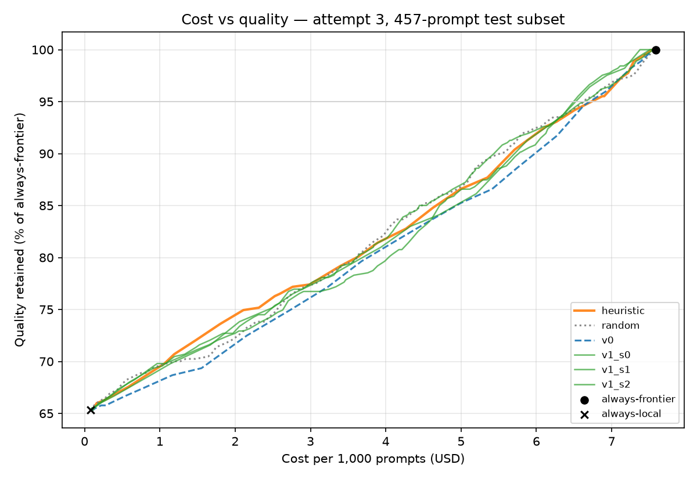
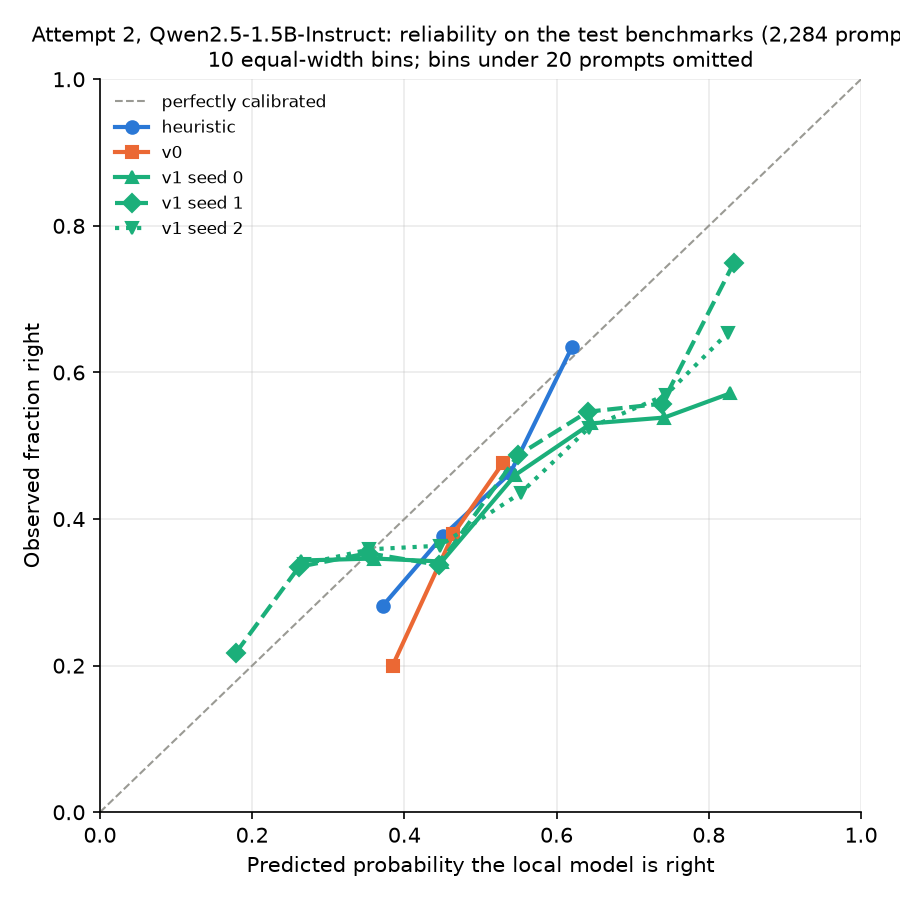

# Switchboard

Switchboard tests whether a small classifier can route each prompt to the cheapest model that can
still answer it, by measuring the saving as a cost-versus-quality curve on public benchmarks.

> **Status: complete, as a negative result.** Three pre-registered attempts, two local models
> (Qwen2.5 1.5B and 7B) against Claude Opus 5.5: the kill gate failed every time. No learned router
> reliably beat a two-feature heuristic or random routing, and the saving at 95% of frontier
> quality stayed between roughly 9% and 14%. Serving infrastructure was deliberately not built.
> Every number in the generated blocks comes from the committed results files via `make readme`.

## Headline

<!-- BEGIN GENERATED: readme-headline -->
| At 95% of always-frontier quality | Attempt 2: `Qwen2.5-1.5B-Instruct` local | Attempt 3: `Qwen2.5-7B-Instruct-AWQ` local |
| --- | --- | --- |
| Local model right (test subset) | 40.0% | 63.9% |
| Learned router, v1 (3 seeds) | **9.0%–10.7% kept local, 90.4%–91.3% of the cost** | **14.4%–16.0% kept local, 85.7%–88.5% of the cost** |
| Length-and-keyword heuristic | 11.4% kept local, 91.8% of the cost | 12.7% kept local, 90.7% of the cost |
| Random routing | 7.9% kept local, 93.0% of the cost | 12.5% kept local, 87.6% of the cost |
| v1 significantly cheaper than the heuristic | no seed | no seed |
| Pre-registered kill gate | **failed** | **failed** |
<!-- END GENERATED: readme-headline -->

```bash
make sweep && make readme   # regenerates the curve, the gate verdict and every number here
```




With either local model, every router — learned, heuristic or random — sits close to the
straight line between always-local and always-frontier. That line is what you get by routing a share of traffic at
random, so a curve on it means the router found almost nothing worth keeping local.

## What was found

1. **A stronger local model raised the ceiling, not the result.** Replacing the 1.5B with a 7B
   lifted local accuracy on the cost subset from 40% to 64% and cut the cost of a *perfect* router
   from about 66% to 44% of always-frontier (R2, attempt 3). The learned routers captured almost
   none of that: their saving rose only from about 9–10% to 12–14%, about what random routing got.
2. **The stronger model's mistakes are harder to predict from the prompt.** Every router's AUROC
   fell with the 7B (heuristic 0.61 → 0.55, fine-tuned v1 about 0.60 → 0.54). The heuristic
   lost the most: the 7B's failures are much less tied to visible signs of difficulty such as
   prompt length and keywords.
3. **A naive learned router learns where a prompt came from, not how hard it is.** Trained on three
   benchmarks, the frozen-encoder router scored 0.71 AUROC on a random row split and 0.55 on unseen
   benchmarks — it had learned each benchmark's base rate. A wider, re-weighted training mix
   (attempt 2) removed that shortcut.
4. **Fine-tuning helped, but only up to the heuristic.** The fine-tuned encoder (v1) beat the
   frozen one beyond its seed spread, and tied a logistic regression on prompt length and a
   twelve-word keyword list. Temperature scaling improved calibration on every seed, but not to
   the 0.05 ECE target; with the 7B it made two seeds worse, most likely because the validation
   benchmark is far easier for the 7B (90% right) than the test benchmarks are (67%).
5. **AUROC gains of a few points did not turn into money.** At these base rates the cost curves of
   all routers lie within the bootstrap noise of one another.

The full analysis, including all three pre-registrations, is in
[`reports/R2-kill-gate.md`](reports/R2-kill-gate.md); the label pipeline and its audits are in
[`reports/R1-labels.md`](reports/R1-labels.md).

## The claim, and how it was allowed to fail

A small classifier can predict, from the prompt alone and before any generation, whether a cheap
self-hosted model will answer correctly. Routing on that prediction should keep most of the quality
of always-frontier at a fraction of the cost.

Written before any training code:

1. **If the heuristic baseline's curve matches or dominates the learned router's curve, the model is
   unnecessary.** — *This happened in both cost-evaluated attempts, for v0 and for two of the three
   v1 seeds each time.*
2. **If random routing at the same escalation rate matches the router's quality, the classifier has
   not learned a usable signal.** — *This also happened, for v0 and two of three v1 seeds each time.*
   One v1 seed per attempt passed one or both, never every seed, and none passed the AUROC floor
   with the 7B.

The roadmap's rule was to stop rather than build serving around a result that does not exist.
The exact pass/fail definitions were committed before the curves were computed.

## Results

<!-- BEGIN GENERATED: readme-results -->
AUROC on all test prompts (95% bootstrap interval); cost and gate criteria on the 457-prompt subset with frontier answers, at 95% quality retention.

**Attempt 2 — local model `Qwen2.5-1.5B-Instruct`.** Right on 41.2% of all 2,284 test prompts; on the 457-prompt subset 40.0% at $0.08 per 1,000 prompts, against the frontier's 97.8% at $7.58.

| Router | Test AUROC | ECE | Kept local | Cost vs always-frontier | C1: beats heuristic | C2: beats random |
| --- | --- | --- | --- | --- | --- | --- |
| heuristic | 0.607 [0.582, 0.629] | 0.074 | 11.4% | 91.8% | — | — |
| random | 0.507 [0.485, 0.532] | 0.248 | 7.9% | 93.0% | — | — |
| v0 | 0.564 [0.542, 0.586] | 0.075 | 7.0% | 93.9% | **fail** | **fail** |
| v1_s0 | 0.596 [0.572, 0.620] | 0.149 → 0.095 | 9.0% | 91.3% | **fail** | pass |
| v1_s1 | 0.604 [0.579, 0.628] | 0.131 → 0.072 | 10.7% | 90.4% | pass | **fail** |
| v1_s2 | 0.587 [0.563, 0.611] | 0.192 → 0.080 | 10.5% | 90.5% | **fail** | **fail** |

v1 mean test AUROC 0.596 (seed spread 0.017); ECE for v1 is before → after temperature scaling.

**Attempt 3 — local model `Qwen2.5-7B-Instruct-AWQ`.** Right on 66.7% of all 2,284 test prompts; on the 457-prompt subset 63.9% at $0.08 per 1,000 prompts, against the frontier's 97.8% at $7.58.

| Router | Test AUROC | ECE | Kept local | Cost vs always-frontier | C1: beats heuristic | C2: beats random |
| --- | --- | --- | --- | --- | --- | --- |
| heuristic | 0.547 [0.522, 0.571] | 0.184 | 12.7% | 90.7% | — | — |
| random | 0.479 [0.454, 0.501] | 0.290 | 12.5% | 87.6% | — | — |
| v0 | 0.505 [0.480, 0.530] | 0.181 | 10.1% | 91.2% | **fail** | **fail** |
| v1_s0 | 0.546 [0.521, 0.570] | 0.219 → 0.290 | 15.3% | 85.7% | pass | pass |
| v1_s1 | 0.531 [0.505, 0.555] | 0.222 → 0.301 | 14.4% | 87.9% | **fail** | **fail** |
| v1_s2 | 0.544 [0.521, 0.568] | 0.237 → 0.202 | 16.0% | 88.5% | **fail** | **fail** |

v1 mean test AUROC 0.540 (seed spread 0.015); ECE for v1 is before → after temperature scaling.

**Why the split matters** — the frozen-encoder router (v0), scored two ways.

| | Dataset-level split (test benchmarks never seen) | Row split — optimistic |
| --- | --- | --- |
| Attempt 1 (train: GSM8K, MMLU, MBPP) | 0.549 [0.524, 0.572] | 0.712 [0.690, 0.734] |
| Attempt 2 (nine train benchmarks, balanced weights) | 0.564 [0.542, 0.586] | 0.599 [0.580, 0.617] |
| Attempt 3 (nine train benchmarks, balanced weights) | 0.505 [0.480, 0.530] | 0.610 [0.588, 0.630] |

Charts: `reports/figures/cost-quality-attempt2.png`, `reports/figures/reliability-attempt2.png`, `reports/figures/cost-quality-attempt3.png`, `reports/figures/reliability-attempt3.png`.
<!-- END GENERATED: readme-results -->



With the 1.5B, the heuristic and v0 rarely leave the 0.35–0.65 band: they almost never make a confident call. v1
spreads its scores wider, which is where its AUROC gain over v0 comes from, but even after
temperature scaling it is over-confident above 0.6.

## How it works

1. **Labels.** A local model — Qwen2.5-1.5B-Instruct, or Qwen2.5-7B-Instruct in 4-bit AWQ for
   attempt 3, served by vLLM on a laptop RTX 4060 (8 GB) — answers every prompt from 13 public
   benchmarks once, greedily. Each answer is graded by machine: exact
   match for numbers, the chosen letter for multiple choice, unit tests in a network-less Docker
   sandbox for code. That gives 18,445 (prompt, local model was right) pairs per model.
2. **Routers.** Each router reads only the prompt and outputs the probability that the local model
   will be right: a length-and-keyword logistic regression (the heuristic), a hash-based random
   score, a frozen `bge-base-en-v1.5` encoder with logistic regression (v0), and the same encoder
   fine-tuned end to end with temperature scaling (v1, three seeds).
3. **Frontier answers.** Claude Opus 5.5, through OpenRouter, answers a stratified 20% of the test
   prompts (457), within a $4 budget enforced by a spend guard that refuses a request before
   sending it if the worst case could exceed the cap.
4. **Sweep.** For every threshold τ from 0 to 1, prompts scoring at least τ stay local and the rest
   escalate. Quality and cost are pure arithmetic over the cached answers; cost is tokens × pinned
   list prices.

## Evaluation design

- **Split by dataset, never by row.** Train: GSM8K, MMLU, MBPP, GSM-Hard, SVAMP, AQuA-RAT,
  CommonsenseQA, MedMCQA, QASC. Validation: ARC-Challenge. Test: MATH, HumanEval, BIG-Bench Hard.
  (`data/splits.yaml`, with a test that fails if any prompt crosses splits.)
- A row-split figure is reported beside it, labelled **optimistic**, with the gap explained.
- Every accuracy is stated next to its **base rate**.
- Only machine-gradable benchmarks. No LLM-as-judge, no human grading; 30-item manual audits of
  the grader were run and recorded in `reports/review/`.
- Thresholds, calibration and the regularisation strength are chosen on validation only; the test
  benchmarks are touched once per pre-registered run.
- Model revisions, prompts and decoding parameters are pinned, and every generation is cached by
  (model@revision, prompt, decoding parameters), so re-running a step never re-queries a model.

## Reproducing the result

```bash
make install                         # env from uv.lock (Python 3.11)
make sandbox-pull                    # digest-pinned Docker image for the code graders
make vllm                            # terminal 1: serve the local model on the GPU
make labels BENCH=all                # terminal 2: generate + grade every benchmark
make train-v0                        # attempt 1 (frozen encoder, narrow mix)
make train-attempt2                  # attempt 2: heuristic, random, v0, v1 x 3 seeds
make frontier FRACTION=0.2 MAX_USD=4 # Claude answers for the test subset (needs OPENROUTER_API_KEY)
make sweep ATTEMPT=2                 # cost-quality curve and gate criteria 1-2
# attempt 3: relabel with the 7B, then train and sweep it
export SWITCHBOARD_LOCAL_MODEL_ID=Qwen/Qwen2.5-7B-Instruct-AWQ
export SWITCHBOARD_LOCAL_MODEL_REVISION=b25037543e9394b818fdfca67ab2a00ecc7dd641
make vllm VLLM_DTYPE=float16 VLLM_MAX_SEQS=16   # terminal 1
make labels BENCH=all                           # terminal 2
make train-attempt3 && make sweep ATTEMPT=3
make readme                          # regenerate this README's numbers and the reliability diagram
make check                           # lint, strict typecheck, unit tests
```

The committed `data/labels/` and `results/` files let `make sweep` and `make readme` run without a
GPU or an API key. Re-asking Claude for the subset costs about $3.50 at list prices.

## Limitations

- **Two local models, one family.** Labels are specific to each model; the conclusion held for
  Qwen2.5 1.5B and 7B, but a different family or a much larger local model was not tested.
- **Three attempts on the same test benchmarks** — a forking path. Each attempt was
  pre-registered and none passed, so this weakens no positive claim, but it is stated.
- **A 457-prompt subset decides the cost curve**, for budget reasons; its intervals are wide. AUROC
  uses all 2,284 test prompts.
- Benchmark prompts are short and clean; production traffic is not.
- Prompt-only routing is strictly weaker than methods that inspect the generation.
- Local cost is a market price for serving a small open model, not a measured GPU cost; the
  verdict is unchanged at zero and at five times that price.
- Single-turn only. Multi-turn routing is a different problem.
- The dataset-level split is harsh; the row-split figure is the optimistic one. Both are reported.

## Related work

- **Cascades** (e.g. FrugalGPT) call the cheap model first and escalate after scoring its answer;
  they pay for a local generation on every prompt, which prompt-only routing avoids.
- **Generation-aware routing** (e.g. AutoMix's self-verification) judges the cheap model's answer
  before escalating; stronger signal, higher latency.
- **Learned prompt-only routers** (e.g. RouteLLM, Hybrid LLM) train on preference or quality-gap
  data and report sizeable savings, mostly with random or in-distribution splits; this project
  tests the same idea on benchmarks the router has never seen and against a heuristic baseline.

## Security posture

This system does not interpret prompts, so injection risk is inherited from the serving model
rather than introduced by the router. Code from model answers runs only in a network-less,
read-only, resource-limited Docker sandbox. API keys live in a gitignored `.env` and are held as
secrets in memory; no key is ever logged.
