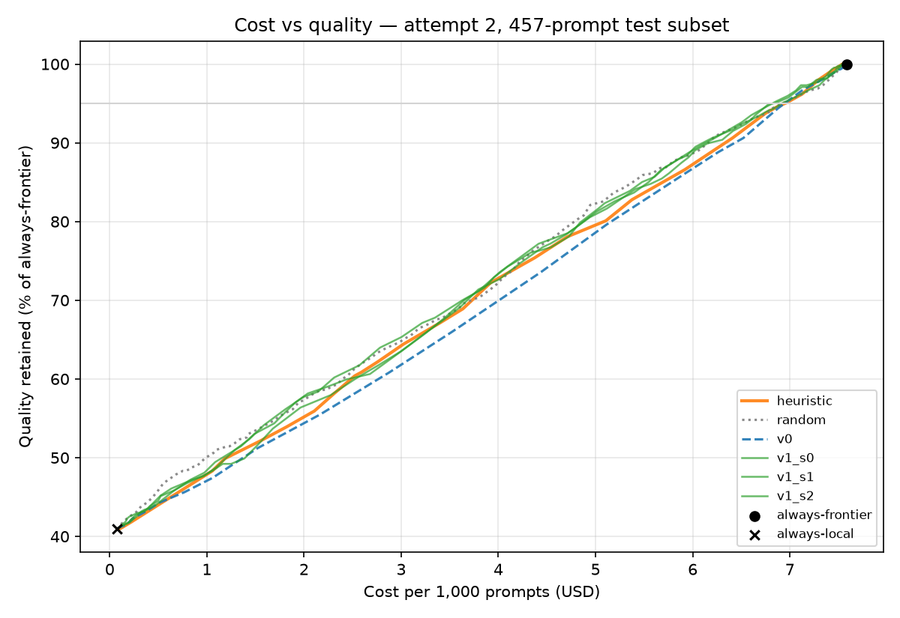

# R2 — Router v0 and the kill gate

> Status: **kill gate FAILED — Phase 2 is complete as a negative result.** Two pre-registered
> attempts: no learned router beats the length-and-keyword heuristic, and on the cost-quality
> curve (457-prompt stratified test subset, $4 budget) every router — learned, heuristic or random —
> sits close to the straight line between always-local and always-frontier. At 95% of
> always-frontier quality the best routers cost about 90–92% of always-frontier; the learned
> routers' small edge over the heuristic is not significant. No serving work is started. Tables
> between GENERATED markers are written by `make train-v0`, `make train-attempt2` and
> `make sweep`; do not edit them by hand.

## 1. What was measured

Whether a router reading only the prompt can tell which prompts the local model answers
correctly, on benchmarks it never saw in training, and whether it does better than a
length-and-keyword heuristic and than random routing.

## 2. Setup

- Labels: `data/labels/Qwen__Qwen2.5-1.5B-Instruct.parquet` (R1).
- Split by dataset: train GSM8K, MMLU, MBPP · validation ARC-Challenge · test MATH, HumanEval, BBH.
  `make check` includes a test that fails if any prompt appears in more than one split.
- Routers, all behind one `predict_proba` interface:
  - **heuristic** — logistic regression on two features: log(1 + word count) and the number of
    keywords from a fixed list (`router/baselines.py`) present in the prompt.
  - **random** — a uniform score from a hash of the prompt, ignoring its content.
  - **v0** — frozen `BAAI/bge-base-en-v1.5` CLS embeddings + logistic regression; C chosen on
    validation AUROC from {0.01, 0.1, 1, 10}.
- Kill-gate criterion 3 was fixed before the first run: v0's 95% bootstrap interval for test
  AUROC must have its lower end above 0.55.

## 3. Results

<!-- BEGIN GENERATED: router-v0 -->
Encoder `BAAI/bge-base-en-v1.5` @ `a5beb1e3e6` (frozen for v0) · seed 0 · split sizes train 6973, val 1172, test 2284

**Dataset-level split** (the headline): routers trained on train benchmarks, C chosen on validation, scored on held-out test benchmarks. 95% bootstrap intervals.

| Router | Val AUROC | Test AUROC | Test 95% CI | Test ECE | Test Brier |
| --- | ---: | ---: | --- | ---: | ---: |
| heuristic | 0.523 | **0.606** | [0.581, 0.629] | 0.243 | 0.293 |
| random | 0.503 | **0.507** | [0.485, 0.532] | 0.248 | 0.329 |
| v0 | 0.559 | **0.549** | [0.524, 0.572] | 0.186 | 0.278 |

Test base rate: 41.2% (the local model is right this often).

**v0 against the baselines on test** (paired bootstrap):

| Comparison | AUROC difference | 95% CI |
| --- | ---: | --- |
| v0 minus heuristic | -0.058 | [-0.090, -0.025] |
| v0 minus random | +0.042 | [0.008, 0.074] |

**Per test benchmark** (where does prompt-only routing work?):

| Benchmark | n | Base rate | Heuristic | Random | v0 | v0 95% CI |
| --- | ---: | ---: | ---: | ---: | ---: | --- |
| bbh | 1620 | 38.4% | 0.575 | 0.517 | 0.520 | [0.489, 0.550] |
| humaneval | 164 | 49.4% | 0.707 | 0.427 | 0.606 | [0.518, 0.688] |
| math | 500 | 47.8% | 0.685 | 0.497 | 0.643 | [0.594, 0.692] |

**Row-level split — OPTIMISTIC, for comparison only** (random 80/20 over all rows; the router can learn which benchmark a prompt came from):

| Router | Row-split AUROC | Dataset-split AUROC | Gap |
| --- | ---: | ---: | ---: |
| heuristic | 0.581 | 0.606 | -0.025 |
| random | 0.506 | 0.507 | -0.000 |
| v0 | 0.712 | 0.549 | +0.164 |

**Diagnostics** — fit on the training benchmarks, and mean score per benchmark against the local model's actual base rate:

| Router | Train AUROC (in-sample) | Test AUROC, pooled | Test AUROC, within-benchmark |
| --- | ---: | ---: | ---: |
| heuristic | 0.606 | 0.606 | 0.608 |
| random | 0.491 | 0.507 | 0.507 |
| v0 | 0.755 | 0.549 | 0.553 |

| Benchmark | Role | Base rate | Heuristic mean score | v0 mean score |
| --- | --- | ---: | ---: | ---: |
| gsm8k | train | 0.809 | 0.666 | 0.793 |
| mbpp | train | 0.461 | 0.682 | 0.478 |
| mmlu | train | 0.545 | 0.617 | 0.556 |
| arc_challenge | val | 0.688 | 0.656 | 0.653 |
| bbh | test | 0.384 | 0.634 | 0.608 |
| humaneval | test | 0.494 | 0.619 | 0.520 |
| math | test | 0.478 | 0.725 | 0.595 |

Prompts longer than the encoder's 512-token limit: 22 (0.21%).

**Kill gate, criterion 3** (v0 test AUROC 95% CI low > 0.55): low = 0.524 → **FAIL**. Criteria 1 and 2: pending the frontier answers and the cost-quality sweep.
<!-- END GENERATED: router-v0 -->

Cost-quality curve, matched-escalation comparison with random, gate criteria 1–2: `TBD` — they
need the frontier model's answers on the test prompts. Criterion 3 already fails, so the gate
fails whatever they show; the curve is still needed for the write-up of either outcome.

### Gate verdict

| Criterion (fixed before the run) | Result |
| --- | --- |
| 1. v0's cost-quality curve dominates the heuristic's | `TBD` (needs frontier answers) — v0's AUROC is below the heuristic's, so this is unlikely |
| 2. v0 beats random routing at matched escalation | `TBD` (needs frontier answers) |
| 3. v0 test AUROC: lower end of 95% interval > 0.55 | **FAIL** (see the generated block) |

**Verdict: FAIL.** Following 11-roadmap: stop building; the options are to change the benchmark
mix, change the local model, or write up the negative result.

## Attempt 2 — pre-registered design

> Written on 2026-10-05, after attempt 1 failed and **before any attempt-2 label, score or metric
> existed**. The owner chose this path (R2 §5, option 2) and asked for the fine-tuned router to be
> evaluated as well. Attempt 1 above stays in this report unchanged; attempt 2 is reported beside
> it, never instead of it.

**What is fixed (identical to attempt 1).** Local model, decoding, graders, the validation benchmark
(ARC-Challenge) and the **test benchmarks (MATH, HumanEval, BBH) and their labels**. The kill-gate
criteria, including the 0.55 floor on the lower end of the 95% test-AUROC interval.

**What changes, and why.**

1. **More, more varied training benchmarks** — six added to GSM8K, MMLU and MBPP, so that "which
   benchmark is this?" stops being a useful shortcut. All public, machine-gradable with the existing
   numeric or multiple-choice graders, pinned by commit:

   | Benchmark | Licence (card) | Grader | Items |
   | --- | --- | --- | --- |
   | GSM-Hard | MIT | numeric | the 1,016 with whole-number answers |
   | SVAMP | MIT | numeric | all 1,000 (train + test files) |
   | AQuA-RAT | Apache-2.0 | multiple choice A–E | 1,500 sampled from train |
   | CommonsenseQA | MIT | multiple choice A–E | 1,500 sampled from train |
   | MedMCQA | Apache-2.0 | multiple choice A–D | 1,500 single-answer, sampled from train |
   | QASC | CC-BY-4.0 | multiple choice A–H | 1,500 sampled from train |

   GSM-Hard matters most: it reads like GSM8K but is much harder, which directly contradicts the
   "GSM8K-looking ⇒ easy" pattern attempt 1 learned.
2. **Benchmark-balanced training weights.** Within each training benchmark, the correct and the
   incorrect examples each receive the same total weight, and every benchmark receives the same
   total weight. Under these weights a router gains nothing from recognising a benchmark, because
   every benchmark is 50/50; only within-benchmark difficulty is left to learn. The same weights
   are applied to the heuristic, so the comparison stays like-for-like.
3. **v1, the fine-tuned router**, evaluated under the same protocol: the same `bge-base-en-v1.5`
   backbone fine-tuned end to end with weighted BCE (AdamW, encoder lr 2e-5, head lr 1e-3, weight
   decay 0.01, 10% linear warm-up then linear decay, up to 4 epochs with early stopping on
   validation AUROC, batch 32, bf16), **3 seeds** reported as mean and spread, and temperature
   scaling fitted on validation only.

**How attempt 2 is judged.** The same three gate criteria, applied to v0 and to v1 separately. In
addition: v1 counts as better than v0 only if its mean test AUROC exceeds v0's by more than the
spread across its three seeds (13-testing-and-reports, Phase 3).

**Known weakness, stated up front.** Attempt 2 was designed after attempt 1's test results were
seen. The test benchmarks are unchanged and nothing in this design was tuned against them, but a
second attempt after a failure is a forking path, and the write-up will say so.

### Attempt 2 — results

<!-- BEGIN GENERATED: router-attempt2 -->
Encoder `BAAI/bge-base-en-v1.5` @ `a5beb1e3e6` (frozen for v0) · seed 0 · split sizes train 14989, val 1172, test 2284

**Dataset-level split** (the headline): routers trained on train benchmarks, C chosen on validation, scored on held-out test benchmarks. 95% bootstrap intervals.

| Router | Val AUROC | Test AUROC | Test 95% CI | Test ECE | Test Brier |
| --- | ---: | ---: | --- | ---: | ---: |
| heuristic | 0.523 | **0.607** | [0.582, 0.629] | 0.074 | 0.239 |
| random | 0.503 | **0.507** | [0.485, 0.532] | 0.248 | 0.329 |
| v0 | 0.526 | **0.564** | [0.542, 0.586] | 0.075 | 0.245 |
| v1_s0 | 0.538 | **0.596** | [0.572, 0.620] | 0.095 | 0.247 |
| v1_s1 | 0.548 | **0.604** | [0.579, 0.628] | 0.072 | 0.240 |
| v1_s2 | 0.551 | **0.587** | [0.563, 0.611] | 0.080 | 0.244 |

Test base rate: 41.2% (the local model is right this often).

**v0 against the baselines on test** (paired bootstrap):

| Comparison | AUROC difference | 95% CI |
| --- | ---: | --- |
| v0 minus heuristic | -0.043 | [-0.070, -0.016] |
| v0 minus random | +0.057 | [0.025, 0.089] |
| v1 s0 minus v0 | +0.032 | [0.011, 0.052] |
| v1 s0 minus heuristic | -0.011 | [-0.036, 0.013] |
| v1 s1 minus v0 | +0.040 | [0.017, 0.063] |
| v1 s1 minus heuristic | -0.003 | [-0.027, 0.020] |
| v1 s2 minus v0 | +0.023 | [0.001, 0.045] |
| v1 s2 minus heuristic | -0.020 | [-0.044, 0.004] |

**Per test benchmark** (where does prompt-only routing work?):

| Benchmark | n | Base rate | Heuristic | Random | v0 | v0 95% CI |
| --- | ---: | ---: | ---: | ---: | ---: | --- |
| bbh | 1620 | 38.4% | 0.576 | 0.517 | 0.541 | [0.515, 0.571] |
| humaneval | 164 | 49.4% | 0.699 | 0.427 | 0.580 | [0.487, 0.660] |
| math | 500 | 47.8% | 0.683 | 0.497 | 0.644 | [0.596, 0.690] |

**Row-level split — OPTIMISTIC, for comparison only** (random 80/20 over all rows; the router can learn which benchmark a prompt came from):

| Router | Row-split AUROC | Dataset-split AUROC | Gap |
| --- | ---: | ---: | ---: |
| heuristic | 0.538 | 0.607 | -0.069 |
| random | 0.497 | 0.507 | -0.010 |
| v0 | 0.599 | 0.564 | +0.035 |

**Diagnostics** — fit on the training benchmarks, and mean score per benchmark against the local model's actual base rate:

| Router | Train AUROC (in-sample) | Test AUROC, pooled | Test AUROC, within-benchmark |
| --- | ---: | ---: | ---: |
| heuristic | 0.542 | 0.607 | 0.608 |
| random | 0.493 | 0.507 | 0.507 |
| v0 | 0.616 | 0.564 | 0.566 |

| Benchmark | Role | Base rate | Heuristic mean score | v0 mean score |
| --- | --- | ---: | ---: | ---: |
| aqua_rat | train | 0.534 | 0.485 | 0.498 |
| commonsense_qa | train | 0.653 | 0.526 | 0.507 |
| gsm8k | train | 0.809 | 0.486 | 0.497 |
| gsm_hard | train | 0.407 | 0.483 | 0.493 |
| mbpp | train | 0.461 | 0.500 | 0.506 |
| medmcqa | train | 0.475 | 0.535 | 0.504 |
| mmlu | train | 0.545 | 0.455 | 0.478 |
| qasc | train | 0.436 | 0.516 | 0.512 |
| svamp | train | 0.801 | 0.521 | 0.519 |
| arc_challenge | val | 0.688 | 0.478 | 0.510 |
| bbh | test | 0.384 | 0.468 | 0.490 |
| humaneval | test | 0.494 | 0.456 | 0.486 |
| math | test | 0.478 | 0.533 | 0.478 |

Prompts longer than the encoder's 512-token limit: 22 (0.12%).

**Kill gate, criterion 3** (v0 test AUROC 95% CI low > 0.55): low = 0.542 → **FAIL**. Criteria 1 and 2: pending the frontier answers and the cost-quality sweep.

**v1 — fine-tuned encoder, 3 seeds** (benchmark-balanced weighted BCE; best epoch by validation AUROC; temperature fitted on validation only):

| Seed | Best epoch | Temperature | Val AUROC | Test AUROC | Test 95% CI | Test ECE before → after | Test Brier before → after |
| --- | ---: | ---: | ---: | ---: | --- | --- | --- |
| v1_s0 | 3 | 2.02 | 0.538 | **0.596** | [0.572, 0.620] | 0.149 → 0.095 | 0.267 → 0.247 |
| v1_s1 | 3 | 1.92 | 0.548 | **0.604** | [0.579, 0.628] | 0.131 → 0.072 | 0.255 → 0.240 |
| v1_s2 | 4 | 2.68 | 0.551 | **0.587** | [0.563, 0.611] | 0.192 → 0.080 | 0.283 → 0.244 |

v1 test AUROC mean 0.596, spread across seeds 0.017; gain over v0 +0.032. Gain larger than the seed spread (pre-registered test of v1 over v0): **YES**.

| Test benchmark | v0 | v1_s0 | v1_s1 | v1_s2 |
| --- | ---: | ---: | ---: | ---: |
| bbh | 0.541 | 0.565 | 0.567 | 0.549 |
| humaneval | 0.580 | 0.578 | 0.563 | 0.554 |
| math | 0.644 | 0.691 | 0.700 | 0.702 |

**Kill gate, criterion 3 for v1** (every seed's 95% CI low > 0.55): lows = 0.572, 0.579, 0.563 → **PASS**.
<!-- END GENERATED: router-attempt2 -->

### Attempt 2 — verdict against the pre-registered tests

| Test (fixed before the run) | v0 | v1 (3 seeds) |
| --- | --- | --- |
| Criterion 3: test-AUROC 95% CI low > 0.55 | **FAIL** | **PASS** on every seed |
| v1 beats v0 by more than the seed spread | — | **YES** |
| Better than the heuristic (paired AUROC, CI above 0) | **NO** — significantly worse | **NO** — tied; every interval includes 0 |
| Criteria 1–2: cost-quality curve vs heuristic and random | `TBD` (frontier answers) | `TBD` (frontier answers) |
| Phase 3 calibration target: test ECE < 0.05 after scaling | — | **NO** — improves on every seed but stays above 0.05 |

**Reading.** The balanced weights did what they were designed to do: every benchmark's mean score
now sits near 0.5 instead of on its base rate, in-sample AUROC fell, and the optimistic row-split
gap shrank sharply. With the shortcut gone, fine-tuning is the first learned router to reach the
heuristic's level on held-out benchmarks — but not to exceed it. Its strength is MATH, where it is
clearly ahead of the heuristic; it is behind on HumanEval. Whether a tie on AUROC becomes a win or a
loss in money depends on *where* each router's errors fall, which only the cost-quality curve can
show.

## Cost-quality evaluation on a budget-limited subset — pre-registered

> Written on 2026-10-07, **before any frontier answer beyond the 30-prompt pilot was collected**.

The owner capped frontier spend at **$4.00** on the OpenRouter key ($0.23 already used by the
pilot). The pilot projected about $14.75 for all 2,284 test prompts, so the cost-quality curve and
gate criteria 1–2 are evaluated on a **stratified subset** instead:

- **20% of each test benchmark**, chosen by the same seeded hash order as every other sample in the
  project (BBH 324, MATH 100, HumanEval 33 — 457 prompts). Because it is the same order, the subset
  contains the 30 pilot prompts, which are reused rather than paid for again.
- Each benchmark keeps its share of the full test set, so the pooled curve estimates the full-test
  curve; it is reported **with bootstrap intervals**, which are wider than a full run's would be.
- **The frontier model is unchanged** (Claude Opus 5.5). A cheaper model would have fitted the
  budget on the full set but would have changed what "always-frontier quality" means.
- Every router is evaluated on exactly the same subset; the full-test AUROC results above are
  unaffected.
- Spend controls: a $3.50 ceiling in the spend guard for this run (worst case $3.73 with the pilot,
  under the $4.00 key limit, which remains a hard backstop), 3 requests in flight.

### How gate criteria 1 and 2 are decided — pre-registered

> Written on 2026-10-07 while the subset's frontier answers were being collected and **before any of
> them (beyond the pilot) had been read**.

Each router's scores are swept over τ = 0.00, 0.01, …, 1.00. At each τ a prompt goes to the local
model if its score is ≥ τ and to the frontier otherwise; quality is the fraction answered correctly
(the local label if routed local, the frontier label if escalated) and cost is the sum of the
per-prompt costs from the cost model. Always-frontier and always-local are marked as points.

- **Quality retention** = routed quality ÷ always-frontier quality on the same prompts.
- **Criterion 1 — the curve dominates the heuristic over a usable range.** The usable range is
  quality retention from 90% to 99% in steps of 1%. At each level, a router's cost is the lowest
  cost over τ that reaches that retention. The router dominates if its cost is ≤ the heuristic's at
  every level and strictly lower at one or more. The cost difference at 95% retention is also
  reported with a 95% bootstrap interval (prompts resampled within each benchmark).
- **Criterion 2 — beats random routing at matched escalation.** At escalation rates of 10%, 20%, …,
  90%, a router's quality (interpolated along its sweep) must exceed the random router's at every
  rate.
- **Operating point.** τ is the lowest-cost threshold retaining ≥ 95% of always-frontier quality.
  It is chosen on the same subset it is reported on — there are no frontier answers for validation
  within the budget — so the operating point is in-sample and is labelled as such.
- **Cost model.** Frontier cost = prompt tokens × $4/M + output tokens × $20/M (the pinned
  OpenRouter prices; the real billed figures are kept beside them). Local cost = output tokens ×
  (GPU hourly rate ÷ measured local throughput), assuming a saturated GPU; the router's own CPU
  cost is treated as zero. The GPU rate and throughput are pinned in `config.py` with their
  sources.
- **Amendment, 2026-10-07, still before any subset answer was read.** No GPU hourly price could
  be retrieved from a verifiable source in this session (the cloud pricing pages did not load), so
  local cost is instead the **market price of serving a small open model of the same family**:
  OpenRouter's listed $0.10 / $0.20 per million input / output tokens for
  `qwen/qwen-2.5-7b-instruct`, the smallest Qwen2.5 model it serves. The local model is the 1.5B,
  so this overstates local cost — the conservative direction. Local cost per prompt = prompt tokens
  × $0.10/M + output tokens × $0.20/M, from the tokens recorded at labelling time. Because the
  router comparison could depend on this assumption, the sweep is repeated with the local price set
  to zero and to five times this value, and those results are reported beside the main one.

## 4. What surprised me

- **The frozen encoder lost to the two-feature heuristic** on held-out benchmarks, and the paired
  difference interval is entirely below zero, so this is not noise.
- **v0 learned where a prompt came from, not how hard it is.** On the training benchmarks its
  mean score lands almost on each benchmark's base rate and its in-sample AUROC is far higher than
  on test (diagnostics table). With only three training benchmarks, "which benchmark is this?" is
  the easiest pattern for an embedding classifier to pick up.
- **The row split would have hidden this completely.** On a random row split v0 looks clearly
  better than on the dataset split, while the heuristic barely changes. This is exactly the
  inflation 04-datasets warned about, and the reason the dataset-level split is non-negotiable.
- **Within each test benchmark v0 also ranks prompts worse than the heuristic**, so the problem is
  not only the ordering *between* benchmarks: frozen general-purpose embeddings capture topic far
  more than difficulty.
- **The heuristic is weak too.** Its held-out AUROC is modest and its validation AUROC is barely
  above chance; it beats v0, but neither is a strong router yet.
- **Only 22 prompts (0.21%) exceed the encoder's 512-token limit**, so truncation is not a factor.

Attempt 2:

- **Removing the shortcut cost in-sample fit and bought generalisation.** v0's in-sample AUROC fell
  while its held-out AUROC rose — the clearest sign the first run had been memorising benchmarks.
- **Fine-tuning helped, consistently**, on all three seeds and most on MATH; the seed spread is small
  next to the gain.
- **A two-feature heuristic is a hard baseline here.** Prompt length is a genuine difficulty signal
  on these test benchmarks, and the heuristic gets it for free. The fine-tuned encoder only matches
  it.
- **Calibration does not transfer across base rates.** Temperature scaling on ARC-Challenge (68.8%
  base rate) roughly halves test ECE but cannot bring it under 0.05 on test benchmarks at 41.2%,
  as R1 predicted.
- **AUROC gains did not become money.** v1's clear AUROC gain over v0 and its tie with the heuristic
  both flatten into curves that sit within a few cents per 1,000 prompts of random routing. At these
  base rates, ranking quality matters far less than how often the local model is right at all.
- **The frontier is nearly perfect on these benchmarks** (97.8% on the subset), so even a perfect
  router could keep local only the prompts the 1.5B model gets right — about 40%.
- **Engineering lesson:** the first attempt-2 run was killed with the session after 50 minutes and
  lost everything; length-grouped batching made training several times faster, and per-seed
  checkpoints mean an interruption now costs at most one seed.

## 5. What this changes

- **No serving work (Phase 4) is started.** The roadmap is explicit that infrastructure is not
  built around a result that does not exist.
- **The frontier answers are still worth collecting.** They depend only on the test prompts, not
  on the router or the local model, so they are needed for the cost-quality curve whichever option
  is chosen, including a negative-result write-up.
- **Attempt 2 settled the provenance question** and produced a learned router (v1) that ties the
  heuristic on AUROC; the cost-quality curve then showed no router clearly better than random
  routing. **The kill gate fails, and per 11-roadmap serving is not built.**
- **Options now** (owner's decision):
  1. **Publish the negative result** (recommended): "prompt-only routing between a 1.5B local
     model and Claude Opus 5.5 saves under ~10% at 95% quality; a learned router ties a
     two-feature heuristic" — with both attempts, the provenance finding and the curve.
  2. **A stronger local model** — the lever this result points at, since the saving is capped by
     how often the local model is right. It needs new labels (free, on the laptop GPU) and the
     same router pipeline; the **frontier answers already collected are reused**, so it costs
     nothing extra on the API.
  3. Stop here.
- **Options after attempt 1** (kept for the record; option 2 was chosen):
- **Options after attempt 1** (kept for the record; option 2 was chosen):
  1. **Write up the negative result** — "prompt-only routing with a frozen encoder learns benchmark
     provenance, not difficulty" — with the cost curve for the heuristic and always-frontier.
  2. **Change the benchmark mix** — train on many more, more varied benchmarks so that benchmark
     identity stops being a usable shortcut, and/or re-weight training so every benchmark has the
     same share of correct and incorrect examples. Labelling is cheap (about half an hour on the
     laptop GPU for the current set).
  3. **Change the local model** — does not address the provenance shortcut by itself.
  4. **Go straight to the fine-tuned v1** — not recommended without option 2: fine-tuning on the
     same three benchmarks would most likely learn provenance even more strongly.

<!-- BEGIN GENERATED: sweep-attempt2 -->
Evaluation subset: 457 test prompts (bbh 324, humaneval 33, math 100).

- **Always-frontier:** quality 97.8%, cost $7.58 per 1,000 prompts.
- **Always-local:** quality 40.0% (40.9% of always-frontier), cost $0.08 per 1,000 prompts.

**Operating point** — cheapest τ retaining ≥ 95% of always-frontier quality (chosen and reported on this subset: in-sample):

| Router | τ | Kept local | Quality retained | Cost vs always-frontier |
| --- | ---: | ---: | ---: | ---: |
| heuristic | 0.59 | 11.4% | 95.1% | 91.8% |
| random | 0.92 | 7.9% | 95.7% | 93.0% |
| v0 | 0.55 | 7.0% | 96.6% | 93.9% |
| v1_s0 | 0.72 | 9.0% | 95.1% | 91.3% |
| v1_s1 | 0.67 | 10.7% | 95.1% | 90.4% |
| v1_s2 | 0.65 | 10.5% | 95.3% | 90.5% |

**Gate criteria 1-2** (pre-registered definitions):

| Router | C1: dominates heuristic, 90-99% retention | C2: beats random at matched escalation | Cost - heuristic at 95% (per 1,000 prompts, 95% CI) |
| --- | --- | --- | --- |
| v0 | FAIL | FAIL | +0.16 [-0.25, +0.36] |
| v1_s0 | FAIL | PASS | -0.04 [-0.38, +0.29] |
| v1_s1 | PASS | FAIL | -0.11 [-0.44, +0.19] |
| v1_s2 | FAIL | FAIL | -0.10 [-0.47, +0.17] |

**Sensitivity to the local price** (criterion 1 / criterion 2 per router):

| Local price x | v0 | v1_s0 | v1_s1 | v1_s2 |
| --- | --- | --- | --- | --- |
| 0.0 | F/F | F/P | P/F | F/F |
| 1.0 | F/F | F/P | P/F | F/F |
| 5.0 | F/F | F/P | P/F | F/F |

Chart: `reports/figures/cost-quality-attempt2.png`.
<!-- END GENERATED: sweep-attempt2 -->

### Cost-quality verdict (criteria 1–2)

| | v0 | v1 seed 0 | v1 seed 1 | v1 seed 2 |
| --- | --- | --- | --- | --- |
| C1: dominates the heuristic over 90–99% retention | FAIL | FAIL (costlier at 96–99%) | **PASS** | FAIL (costlier at 99%) |
| C2: beats random at every escalation rate 10–90% | FAIL | **PASS** | FAIL (at 10%) | FAIL (at 10%, 60%, 70%) |
| Both | no | no | no | no |

**Verdict: the kill gate fails.** No router passes both criteria on any seed, and the result does
not depend on the local-price assumption (identical at zero and five times the price). The
learned routers are near-misses rather than clear failures — v1 is the cheapest router at 95%
retention on every seed — but by margins the bootstrap intervals cannot separate from zero, and
"dominates" and "beats" were defined before the curve was seen.

**Why the curve is nearly a straight line.** On this subset the local model is right on 40.0% of
prompts and the frontier on 97.8%. Holding 95% of frontier quality therefore leaves room to keep
only about 10% of traffic local, whoever picks it, and with prompt-only AUROC around 0.6 the router
cannot pick that 10% much better than chance. The saving available to *any* prompt-only router is
bounded by how often the local model is right; with a 1.5B model and these hard test benchmarks,
that bound is small.
